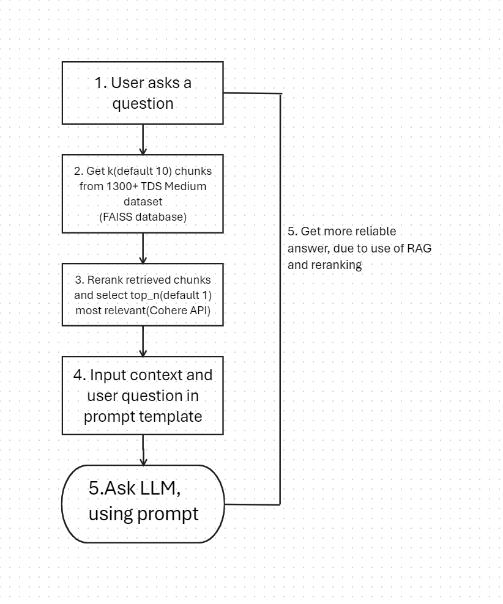

# Project overview
This is a Question-Answering program based on [TinyLlama/TinyLlama-1.1B-Chat-v1.0](https://huggingface.co/TinyLlama/TinyLlama-1.1B-Chat-v1.0) llm from [HuggingFace](https://huggingface.co/). The project also involves RAG system based on [1300+ Towards DataScience Medium Articles Dataset](https://www.kaggle.com/datasets/meruvulikith/1300-towards-datascience-medium-articles-dataset) data set from kaggle.

Retrieve Augmented Generation in my program works as follows:



# Set up and configuration
You can download the repository via the command
```
git clone https://github.com/DzmitryPihulski/LLM_question_and_answer_system_with_RAG.git
```
Install all the libraries by running, I used python version 3.11.4

```
pip install -r requirements.txt
```
And after that run the main.py
It will generate a response for the test question.
If you want to change the question, you must change it in the main.py, "test_query" variable.